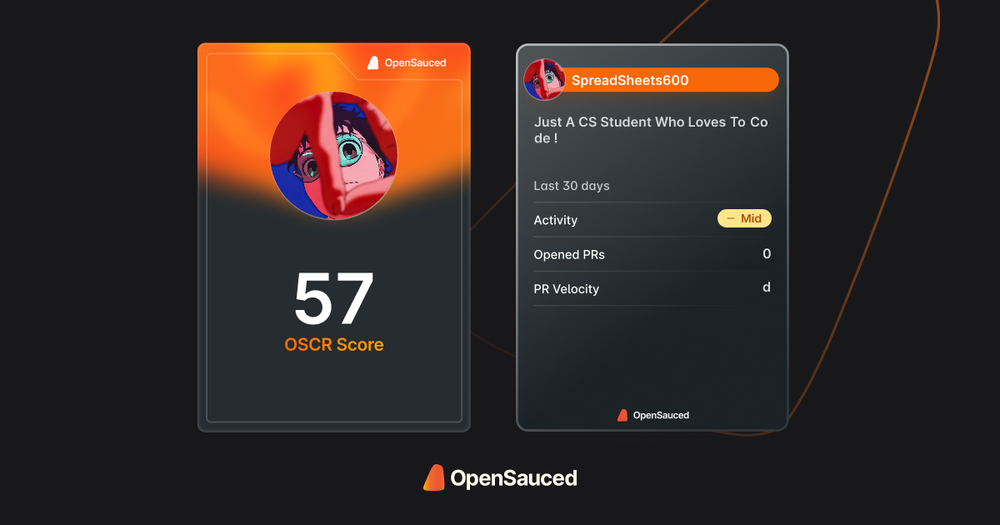

<div
  style="
    font-family: Consolas, sans-serif;
    color: #fff;
    line-height: 1.6;
    max-width: 1200px;
    margin: auto;
    padding: 20px;
    background-color: #1c1c1c;
    border-radius: 10px;
    box-shadow: 0 0 15px rgba(0, 0, 0, 0.5);
  "
>
  <h3 style="margin-left: 0; margin-right: 0">
    <samp style="font-size: 1.5rem; color: #ffffff">「</samp>
  </h3>

  <div align="center" style="align-items: center; align-self: center; align-content: center">
    <h3
      style="
        align-items: center;
        align-self: center;
        align-content: center;
        text-align: center;
      "
    >
      <samp>
        <b
          style="
            font-size: 1.75rem;
            color: #ffffff;
            align-items: center;
            align-self: center;
            align-content: center;
          "
        >
          Hello There
          <br />
          I'm <span style="color: #ffffff">SOHAM</span>, Just A Computer Science
          Student And A Tech Enthusiast.
          <br />
          I Try To Build Aesthetic Projects. I Love To Code Discord Bots And
          Watch Anime.
          <br />
          ~ SOHAM ~
        </b>
      </samp>
    </h3>
  </div>

  <h3 align="right" style="text-align: right; margin: 0">
    <samp style="font-size: 1.5rem; color: #ffffff">」</samp>
  </h3>

  <div align = "center" style="margin: 20px 0; align-items: center; text-align: center">
    <a href="https://blog.spreadsheets600.me">
      
    </a>
  </div>

  <br />

  <div
    style="display: flex; justify-content: space-between; margin-bottom: 20px"
  >
    <details
      style="
        border: 1px solid #444;
        border-radius: 5px;
        padding: 10px;
        background-color: #2b2b2b;
        flex: 1;
        margin-right: 10px;
      "
    >
      <summary style="font-size: 1.5rem; cursor: pointer; color: #ffffff">
        <h2><samp>⛽ Status</samp></h2>
      </summary>
      <div style="margin-top: 10px">
        <table style="width: 100%; margin-bottom: 20px; border: 1px solid #555">
          <tr>
            <td style="text-align: left; padding: 10px">
              <h1 style="font-size: 1.5rem; color: #ffffff">
                <samp>Discord</samp>
              </h1>
              <a href="">
                
              </a>
            </td>
          </tr>
          <tr>
            <td style="text-align: left; padding: 10px">
              <h1 style="font-size: 1.5rem; color: #ffffff">
                <samp>Spotify</samp>
              </h1>
              <a href="https://open.spotify.com/user/x4o0yd3uqpjbzgo1atn61ik6l">
                
              </a>
            </td>
          </tr>
        </table>
      </div>
    </details>
<div>
    <details
      style="
        border: 1px solid #444;
        border-radius: 5px;
        padding: 10px;
        background-color: #2b2b2b;
        flex: 1;
      "
    >
      <summary style="font-size: 1.5rem; cursor: pointer; color: #ffffff">
        <h2><samp>🏆 Trophies</samp></h2>
      </summary>
      <div style="margin-top: 10px">
        <table style="width: 100%; border: 1px solid #555">
          <tr>
            <td style="text-align: left; padding: 10px">
              <a href="#--------">
                
              </a>
            </td>
          </tr>
        </table>
      </div>
    </details>
  </div>

  <details>
    <summary><h2 style="text-align: left"><samp>📁 Repositories</samp></h2></summary>
    <br>
      <p align="center">
          <a href="https://github.com/SpreadSheets600"></a>
          <a href="https://github.com/SpreadSheets600"></a>
          <a href="https://github.com/SpreadSheets600"></a>
          <a href="https://github.com/SpreadSheets600"></a>
          <a href="https://github.com/SpreadSheets600"></a>
          <a href="https://github.com/SpreadSheets6003"></a>
          <a href="https://github.com/SpreadSheets600"></a>
          <a href="https://github.com/SpreadSheets600"></a>
      </p>
  </details>

  <details>
    <summary><h2 style="text-align: left"><samp>📺 Anilist Stats</samp></h2></summary>
    <br>
    
  <table>
    <tr>
      <td colspan="2" align="center">
        </img>
        
      </td>
    </tr>
  </table>
  </details>

<div>
    <details
      style="
        border: 1px solid #444;
        border-radius: 5px;
        padding: 10px;
        background-color: #2b2b2b;
        flex: 1;
      "
    >
  <summary>
    <h2 style="text-align: left"><samp>📈 Open Source Stats</samp></h2>
  </summary>

  <div align = "center" style="text-align: center,align-items: center; align-self: center; align-content: center">
    <table style="width: 800px; margin: 0 auto; border-collapse: collapse; border: 1px solid #ccc;">
  <tr>
    <td style="width: 400px; height: 200px; padding: 10px; text-align: center; vertical-align: middle;">
      
    </td>
    <td style="width: 400px; height: 200px; padding: 10px; text-align: center; vertical-align: middle;">
      
    </td>
  </tr>
</table>

  </div>

  </details>
</div>
  <div>
    <details>	
      <summary>
        <h2 style="text-align: left"><samp>🔗 GSSoC (24) Badges</samp></h2>
      </summary>
        <div style='display:flex; align-items:center; gap: 10px;' align='center'><a href="https://gssoc.girlscript.tech/leaderboard">
          
        </div>
    </details>
  </div>

  <h2 style="text-align: left; color: #ffffff">GitHub Stats</h2>

  <div style="margin: 20px 0">
    <table style="width: 100%; margin-bottom: 20px; border: 1px solid #555">
      <tr>
        <td style="text-align: center; padding: 10px">
          <a href="https://git.io/streak-stats">
            
          </a>
        </td>
      </tr>
    </table>
    <table style="width: 100%; margin-bottom: 20px">
      <tr>
        <td style="text-align: center; padding: 10px; border: 1px solid #555">
          <a href="#--------">
            
          </a>
        </td>
        <td
          style="
            text-align: center;
            padding: 10px;
            border: 1px solid #555;
            border-spacing: 100px;
          "
        >
          <a href="#--------">
            
          </a>
        </td>
      </tr>
    </table>
    <table style="width: 100%; margin-bottom: 20px; border: 1px solid #555">
      <tr>
        <td style="text-align: center; padding: 10px">
          <a href="#--------">
            
          </a>
        </td>
      </tr>
    </table>
    <br />
  </div>
    <div align="center">
    <a href="https://bento.me/spreadsheets">
      
    </a>
    <a href="http://spreadsheets600.me">
      
    </a>
    <a href="https://dev.to/sspreadsheets600">
      
    </a>
    <a href="https://stackoverflow.com/users/23220449/soham-maity">
      
    </a>
    <a href="https://www.linkedin.com/in/soham-maity-114466218/">
      
    </a>
  </div>
  <br>
  <div>
    <a herf="https://holopin.io/@spreadsheets600">
      
    </a>
  </div>

  <br />

---
<!--START_SECTION:waka-->


**I'm an Early 🐤** 

```text
🌞 Morning                1015 commits        ████████░░░░░░░░░░░░░░░░░   30.55 % 
🌆 Daytime                666 commits         █████░░░░░░░░░░░░░░░░░░░░   20.05 % 
🌃 Evening                1486 commits        ███████████░░░░░░░░░░░░░░   44.73 % 
🌙 Night                  155 commits         █░░░░░░░░░░░░░░░░░░░░░░░░   04.67 % 
```
📅 **I'm Most Productive on Tuesday** 

```text
Monday                   525 commits         ████░░░░░░░░░░░░░░░░░░░░░   15.80 % 
Tuesday                  544 commits         ████░░░░░░░░░░░░░░░░░░░░░   16.38 % 
Wednesday                475 commits         ████░░░░░░░░░░░░░░░░░░░░░   14.30 % 
Thursday                 421 commits         ███░░░░░░░░░░░░░░░░░░░░░░   12.67 % 
Friday                   316 commits         ██░░░░░░░░░░░░░░░░░░░░░░░   09.51 % 
Saturday                 529 commits         ████░░░░░░░░░░░░░░░░░░░░░   15.92 % 
Sunday                   512 commits         ████░░░░░░░░░░░░░░░░░░░░░   15.41 % 
```


📊 **This Week I Spent My Time On** 

```text
🕑︎ Time Zone: Asia/Kolkata

💬 Programming Languages: 
HTML                     17 hrs 57 mins      ████████████████████░░░░░   78.65 % 
Python                   3 hrs 26 mins       ████░░░░░░░░░░░░░░░░░░░░░   15.04 % 
Markdown                 1 hr 3 mins         █░░░░░░░░░░░░░░░░░░░░░░░░   04.66 % 
JSON                     12 mins             ░░░░░░░░░░░░░░░░░░░░░░░░░   00.90 % 
Bash                     3 mins              ░░░░░░░░░░░░░░░░░░░░░░░░░   00.23 % 

🔥 Editors: 
VS Code                  22 hrs 50 mins      █████████████████████████   100.00 % 

💻 Operating System: 
WSL                      22 hrs 50 mins      █████████████████████████   100.00 % 
```

**I Mostly Code in Python** 

```text
Python                   55 repos            ████████████░░░░░░░░░░░░░   48.67 % 
HTML                     18 repos            ████░░░░░░░░░░░░░░░░░░░░░   15.93 % 
CSS                      7 repos             ██░░░░░░░░░░░░░░░░░░░░░░░   06.19 % 
Vue                      3 repos             █░░░░░░░░░░░░░░░░░░░░░░░░   02.65 % 
Rust                     1 repo              ░░░░░░░░░░░░░░░░░░░░░░░░░   00.88 % 
```


<!--END_SECTION:waka-->
---
  <br />

  <h2 style="text-align: left; color: #ffffff">Language And Tools</h2>

  <div style="margin: 20px 0">
    <h3 style="color: #ffffff; padding: 10px"><samp>Languages</samp></h3>
    <div style="margin-bottom: 20px">
      <a
        ></a>
    </div>
    <div>
    <div></div>
    <h3 style="color: #ffffff; padding: 10px"><samp>Technologies</samp></h3>
    <div style="margin-bottom: 20px">
      <a
        ></a>
    </div>

</div>
    <h3 style="color: #ffffff; padding: 10px"><samp>Design & Creativity</samp></h3>
    <div style="margin-bottom: 20px">
      <a
        ></a>
    </div>
<div></div>
    <h3 style="color: #ffffff; padding: 10px"><samp>Database</samp></h3>
    <div style="margin-bottom: 20px">
      <a
        ></a>
    </div>
<div>
    <h3 style="color: #ffffff; padding: 10px"><samp>Tools</samp></h3>
    <div style="margin-bottom: 20px">
      <a
        ></a
      ><br />
      <a
        ></a>
    </div>
  </div>
</div>
